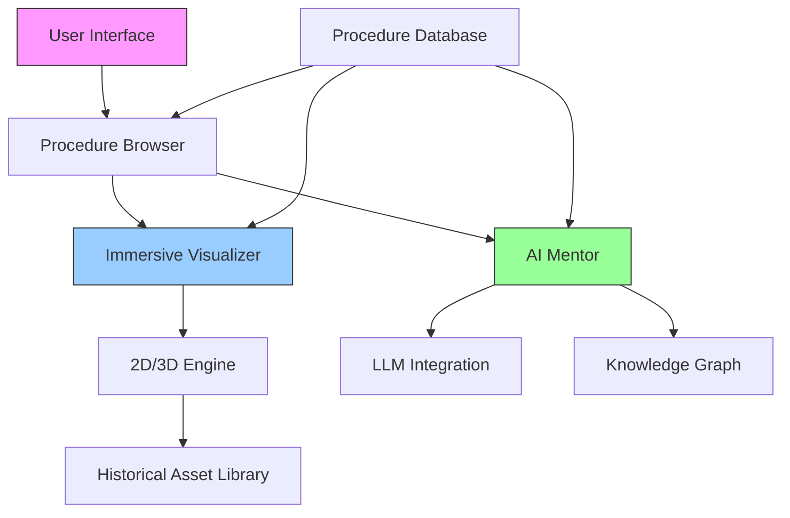

# GhostDoc
Surgical Mentor — Immersive Medical Learning Platform

Revolutionizing surgical education through interactive, historical-style anatomical visualizations and AI mentorship.


---

🎯 Vision Statement

"To create the most immersive surgical education platform that bridges centuries of medical knowledge with cutting-edge technology — making complex procedures understandable for students, professionals, and the curious alike."

🏛️ Inspiration & Design Philosophy

This project draws inspiration from:

· 19th century anatomical atlases (Gray's Anatomy, Bourgery)
· Renaissance-era surgical theaters
· Modern interactive learning platforms
· AI-assisted medical training systems

We believe that the aesthetics of knowledge matter. The rich, detailed style of historical medical illustrations isn't just beautiful — it creates a psychological environment conducive to deep, focused learning.

---

✨ Core Features

1. Dual-Mode Learning System

Mode Audience Description
Professional Medical students, surgeons Detailed anatomical terminology, procedural steps, instrument specifications
Normal Patients, curious learners Plain-language explanations, analogies, "why this matters" context

2. Immersive Procedural Visualization

· Step-by-step anatomical animations in historical engraving style
· Interactive 2D/3D models with layer-by-layer dissection
· Real-time procedural guidance with visual cues
· Historical context for each procedure

3. AI Surgical Mentor

· Context-aware explanations adapting to user's knowledge level
· Procedural Q&A with historical and modern perspectives
· Case-based learning with complication management
· Progress tracking and personalized learning paths

4. Comprehensive Procedure Library

· 75+ detailed surgical procedures (and growing)
· Standardized format for consistent learning experience
· Cross-referenced with modern medical literature
· Multi-language support (starting with English)

---

🗺️ Roadmap & Current Status

Phase 1: Core MVP (Current)

· ✅ Database: 75+ procedures with dual-mode descriptions
· ✅ Design System: Historical anatomical illustration style
· 🔄 Interactive Prototype: Appendectomy immersive visualization
· 🔄 Basic Web Interface: Procedure browser with dual-mode toggle

Phase 2: Platform Expansion

· Full interactive visualization for 10 core procedures
· AI Mentor prototype with basic Q&A capabilities
· Mobile-responsive design
· User progress tracking

Phase 3: Advanced Features

· VR/AR surgical theater experience
· Multiplayer learning sessions
· Institutional dashboards for medical schools
· Certification pathways with competency assessment

---

🏗️ Technical Architecture



Technology Stack

· Frontend: React/Three.js for immersive 3D, SVG for historical illustrations
· Backend: Node.js/Express with medical knowledge graph
· Database: PostgreSQL for procedure library, Redis for caching
· AI/ML: Custom fine-tuned LLMs for medical explanations
· Hosting: Docker containers, scalable cloud architecture

---

📊 Current Procedure Coverage

Specialty Procedures Status
General Surgery 25 ✅ Complete
Orthopedic 15 ✅ Complete
Neurosurgery 10 🔄 In Progress
Cardiothoracic 8 🔄 In Progress
Gynecological 12 ✅ Complete
Urological 5 🔄 In Progress

Total: 75+ procedures with detailed step-by-step descriptions

---

🎨 Visual Design System

Historical Style Guidelines

· Color Palette: Sepia, parchment, ink-black, anatomical reds/blues
· Typography: Serif fonts (EB Garamond, Crimson Pro) for body; display fonts for headings
· Illustration Style: Cross-hatching, detailed line work, labeled diagrams
· UI Elements: Leather-bound book aesthetics, brass fittings, parchment scrolls

Interactive Elements

· Hover annotations: Historical terms with modern explanations
· Layer toggles: Peel away anatomical layers
· Procedural timeline: Step-by-step progression with visual feedback
· Comparison views: Historical vs modern techniques

---

🤝 Collaboration Opportunities

For Medical Institutions

· Curriculum integration for surgical training programs
· Custom procedure libraries for specialty departments
· Research partnership for validation studies
· Continuing education modules for practicing surgeons

For Developers & Designers

· Interactive visualization challenges
· Medical AI/ML research opportunities
· Historical-medical interface design
· Accessibility features for diverse learning needs

For Investors & Partners

· EdTech market entry with unique positioning
· Medical simulation industry expansion
· Global health education initiatives
· VR/AR surgical training next-generation platform

---

🚀 Getting Started

For Developers

```bash
# Clone repository
git clone https://github.com/your-username/surgical-mentor.git

# Install dependencies
cd surgical-mentor
npm install

# Run development server
npm run dev

# Access prototype
open http://localhost:3000
```

For Medical Professionals

· Review procedures: Browse our detailed surgical library
· Provide feedback: Help us improve accuracy and educational value
· Contribute expertise: Join our medical advisory board
· Pilot testing: Implement in your educational programs

---

📚 Educational Philosophy

Why Historical Aesthetics?

1. Cognitive Engagement: Detailed illustrations promote deeper observation
2. Historical Continuity: Connects modern practice to centuries of knowledge
3. Reduced Cognitive Load: Familiar book-like interface for complex material
4. Art-Science Bridge: Makes anatomical learning memorable and beautiful

Learning Principles

· Spaced Repetition: Built-in review of critical concepts
· Dual Coding: Visual + textual information together
· Metacognition: Encourages self-assessment of understanding
· Contextual Learning: Procedures explained within broader medical knowledge

---

🌍 Impact Goals

Short-term (1-2 years)

· 10,000+ medical students using platform
· 500+ procedures in detailed library
· Partnerships with 5+ medical schools
· Validation studies on learning outcomes

Long-term (3-5 years)

· Global standard for surgical education
· AR/VR surgical theaters in medical institutions
· AI surgical assistants trained on platform data
· Democratized access to surgical education worldwide

---

👥 Team & Contributors

Core Team

· Niko — Founder, Full-stack Development & Medical Research
· Seeking: Medical Illustrators, Surgical Educators, UI/UX Designers

Advisory Board (Planned)

· Historical Medical Illustrators
· Board-certified Surgeons
· Medical Education Specialists
· EdTech Entrepreneurs

Contribution Guidelines

We welcome:

· Medical expertise for procedure validation
· Design talent for historical-modern interface
· Development skills for interactive features
· Research partnerships for educational studies

---

📞 Contact & Collaboration

Interested in partnering?

insta: @doi_qw_
x: @nikoo_qw

---

⚠️ Important Disclaimers

Medical Accuracy

This platform is an educational tool, not a substitute for formal medical training, clinical experience, or professional medical advice. All procedures should be performed only by qualified medical professionals in appropriate clinical settings.

Data Privacy

User data is anonymized and protected. Medical information is handled with strict confidentiality in compliance with international data protection standards.

Open Source Philosophy

While core educational content remains proprietary to ensure accuracy, our platform architecture and tools are open for collaboration and innovation in medical education technology.

---

📜 License & Usage

· Educational Content: Proprietary (accuracy-controlled distribution)
· Platform Code: MIT License (open collaboration)
· Design Assets: Mixed (historical works in public domain, new works proprietary)
· Medical Data: HIPAA/GDPR compliant handling

---

🌟 Why This Matters

"In an age of algorithmic medicine and robotic surgery, we risk losing the art of observation, the craft of manual skill, and the historical wisdom embedded in centuries of surgical practice. This platform seeks to preserve that wisdom while leveraging modern technology to train the next generation of healers."

---

🔬 Currently in active development. Prototype available for selected partners and contributors.
